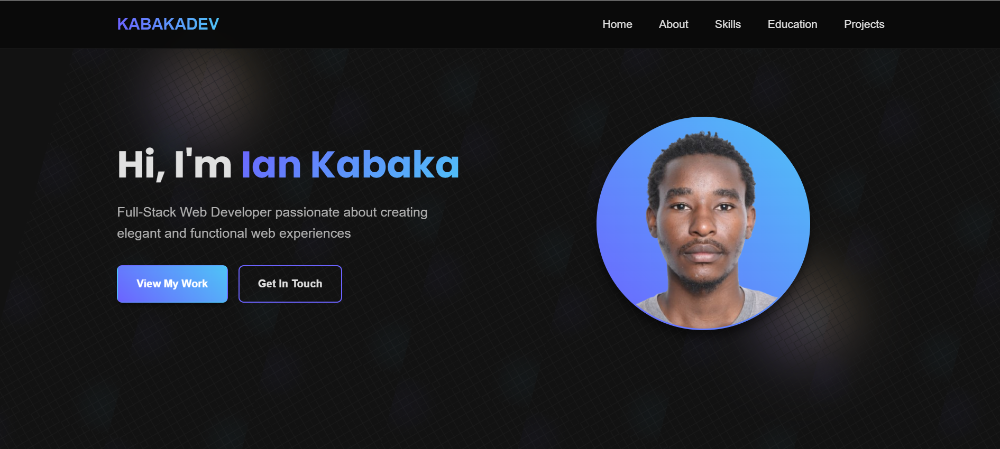
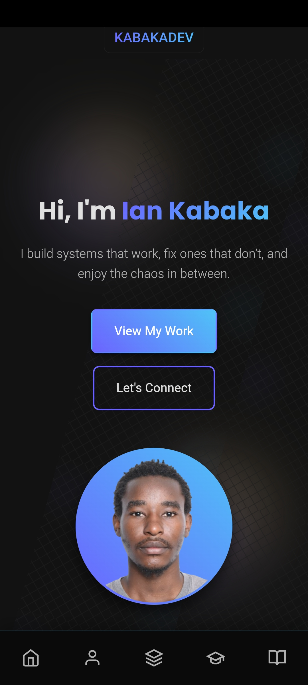

# Ian Kabaka – Portfolio Website

## Overview

This is my professional portfolio website showcasing my skills, projects, and experience as a **Full-Stack Web Developer**. The site features a modern, responsive design with clean aesthetics and intuitive navigation.

<h3 align="center">Responsive Previews</h3>

<p align="center">
  
  
</p>

---

## 🌐 Live Site

You can view the live portfolio here:  
🔗 [kabakadev.github.io/plp_portfolio_hackathon](https://kabakadev.github.io/plp_portfolio_hackathon/)

---

---

## ✨ Features

- **Responsive Design**: Fully responsive layout for mobile, tablet, and desktop
- **Modern UI Components**: Clean, accessible interface with smooth animations
- **Comprehensive Sections**:
  - Hero section with profile introduction
  - About Me with professional background
  - Skills & Technologies categorized by expertise
  - Education details with CV download
  - Featured project showcase
  - Contact information and social links

---

## 🛠 Technologies Used

### Frontend

- **HTML5**: Semantic markup for accessibility
- **CSS3**: Modern styling with Flexbox and Grid
- **Google Fonts**: Poppins font family

### Development Tools

- **CSS Architecture**: Component-based styling structure
- **Git**: Version control
- **Figma**: Design prototyping (as per skills section)

---

## 📁 Project Structure

```
portfolio/
├── index.html
├── reset.css
├── main.css
├── components/
│   ├── navbar.css
│   ├── hero.css
│   ├── about.css
│   ├── skills.css
│   ├── education.css
│   ├── projects.css
│   └── footer.css
├── assets/
│   ├── images/
│   │   ├── profile-photo.png
│   │   └── flashlearn.png
│   └── ian_kabaka_cv.pdf
└── README.md
```

---

## 🚀 Installation & Usage

To run this project locally:

1. **Clone the repository:**

```bash
git clone https://github.com/kabakadev/plp_portfolio_hackathon.git
```

2. **Open `index.html` in your browser**

> No build process or dependencies required — it's pure HTML/CSS!

---

## 🎓 Featured Project: Flashcard Learning Platform

A full-featured learning platform built with:

- React frontend
- Python/Flask backend
- PostgreSQL database
- REST API architecture

🔗 [Live Demo](https://flashlearn254.netlify.app/)  
💻 [Source Code](https://github.com/kabakadev/flashlearn-frontend.git)

---

## 📬 Contact

- **GitHub**: [kabakadev](https://github.com/kabakadev)
- **LinkedIn**: [ian-kabaka](https://www.linkedin.com/in/ian-kabaka)
- **Twitter**: [@kabaka_ian](https://twitter.com/kabaka_ian)
- **Email**: iankabaka1@gmail.com

---

> Developed with passion by **Ian Kabaka**  
> _Full-Stack Web Developer_
